# Continuous-Build-and-Delivery-Assignment2
Continuous Build and Delivery Assignment 2

---

## Quick Start

### 1. Start Infrastructure

```bash
# Start GitLab, Jenkins, and SonarQube
docker-compose up -d

# Wait for services to be healthy
docker-compose ps
```

### 2. Build All MCP Servers

```bash
# Build all MCP servers at once
cd mcp-servers
npm run build:all

# Or build individually
cd jenkins-mcp-server && npm install && npm run build && cd ..
cd sonarqube-mcp-server && npm install && npm run build && cd ..
cd gitlab-mcp-server && npm install && npm run build && cd ..
```

### 3. Configure Credentials

```bash
# Copy example config and edit with your credentials
cp mcp-servers/config.example.json mcp-servers/config.json
# Edit mcp-servers/config.json with your tokens
```

### 4. Test with Simulator

```bash
cd mcp-simulator
npm install
npm start
```

---

## Building MCP Servers

### Prerequisites

- Node.js 18+
- npm

### Build All Servers

From the `mcp-servers` directory:

```bash
cd mcp-servers

# Install and build all servers
for dir in jenkins-mcp-server sonarqube-mcp-server gitlab-mcp-server; do
  echo "Building $dir..."
  cd $dir
  npm install
  npm run build
  cd ..
done
```

### Build Individual Servers

**Jenkins MCP Server:**
```bash
cd mcp-servers/jenkins-mcp-server
npm install
npm run build
```

**SonarQube MCP Server:**
```bash
cd mcp-servers/sonarqube-mcp-server
npm install
npm run build
```

**GitLab MCP Server:**
```bash
cd mcp-servers/gitlab-mcp-server
npm install
npm run build
```

### Development Mode (Watch)

For development with auto-rebuild on changes:

```bash
cd mcp-servers/jenkins-mcp-server
npm run dev  # Watches for changes and rebuilds
```

### Verify Build

After building, verify the `dist/` directory exists:

```bash
ls mcp-servers/jenkins-mcp-server/dist/
# Should show: index.js, jenkins-client.js, tools/
```

---

## Central Configuration

All MCP servers use a central configuration file for easy management of endpoints and credentials.

### Configuration File

Create `mcp-servers/config.json` (copy from `config.example.json`):

```json
{
  "$schema": "./config.schema.json",
  "jenkins": {
    "url": "http://localhost:9001",
    "user": "admin",
    "token": "your-jenkins-api-token"
  },
  "sonarqube": {
    "url": "http://localhost:9000",
    "token": "sqa_your-sonarqube-token"
  },
  "gitlab": {
    "url": "http://localhost:9003",
    "token": "glpat-your-gitlab-token"
  }
}
```

### Configuration Priority

Each MCP server loads configuration in this order (higher priority first):

1. **Environment variables** - Override any config file values
2. **config.json** - Central configuration file

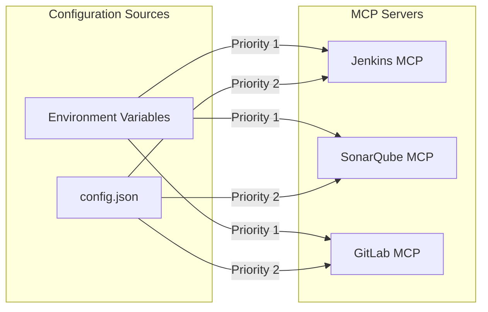

### File Structure

```text
mcp-servers/
├── config.json              # Your configuration (gitignored)
├── config.example.json      # Example configuration (committed)
├── config.schema.json       # JSON schema for IDE support
├── jenkins-mcp-server/
├── sonarqube-mcp-server/
└── shared/                  # Shared utilities
```

### Security Notes

- `config.json` is gitignored to prevent accidental commit of secrets
- Use `config.example.json` as a template
- Environment variables can override config file values for CI/CD

---

## MCP Server Architecture for Jenkins and SonarQube

### Overview

MCP (Model Context Protocol) servers act as bridges between AI assistants (like Claude) and external tools. This architecture enables Claude to interact with Jenkins CI/CD pipelines and SonarQube code quality analysis.

### High-Level Architecture

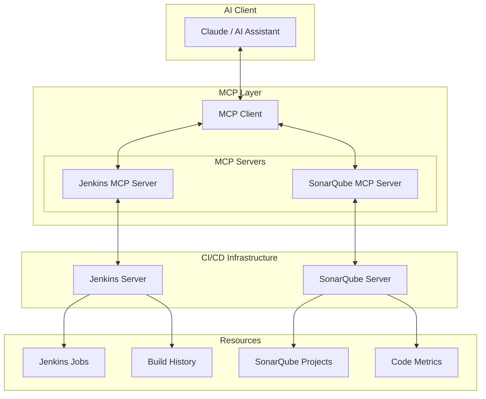

### Detailed Component Interaction

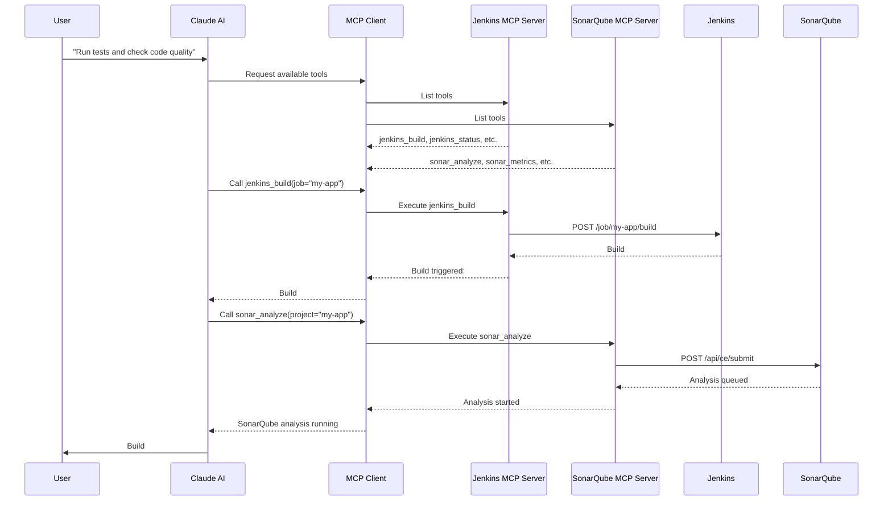

### MCP Server Structure

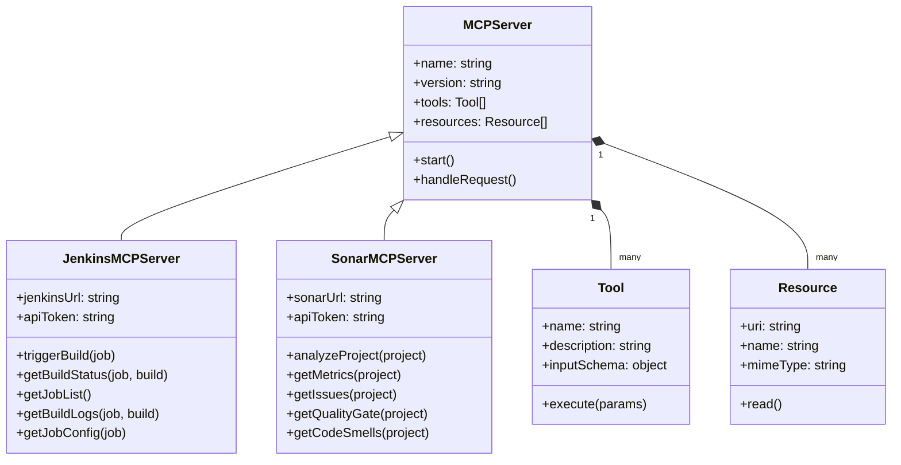

### Configuration Setup

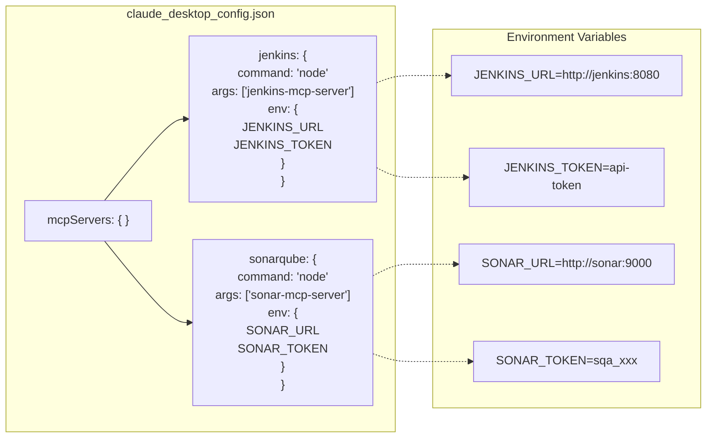

### Available Tools

#### Jenkins MCP Server Tools

| Tool | Description | Parameters |
|------|-------------|------------|
| `jenkins_trigger_build` | Trigger a Jenkins job build | `job_name`, `parameters` |
| `jenkins_get_build_status` | Get status of a specific build | `job_name`, `build_number` |
| `jenkins_get_build_log` | Retrieve build console output | `job_name`, `build_number` |
| `jenkins_list_jobs` | List all available jobs | `folder` (optional) |
| `jenkins_get_job_config` | Get job configuration XML | `job_name` |
| `jenkins_abort_build` | Abort a running build | `job_name`, `build_number` |

#### SonarQube MCP Server Tools

| Tool | Description | Parameters |
|------|-------------|------------|
| `sonar_analyze` | Trigger code analysis | `project_key`, `branch` |
| `sonar_get_metrics` | Get project quality metrics | `project_key` |
| `sonar_get_issues` | List code issues | `project_key`, `severity`, `type` |
| `sonar_get_quality_gate` | Get quality gate status | `project_key` |
| `sonar_get_hotspots` | Get security hotspots | `project_key` |
| `sonar_get_coverage` | Get code coverage report | `project_key` |

### Implementation Example

```text
project-root/
├── mcp-servers/
│   ├── jenkins-mcp-server/
│   │   ├── package.json
│   │   ├── src/
│   │   │   ├── index.ts          # Server entry point
│   │   │   ├── tools/            # Tool implementations
│   │   │   │   ├── build.ts
│   │   │   │   ├── status.ts
│   │   │   │   └── logs.ts
│   │   │   └── jenkins-client.ts # Jenkins API wrapper
│   │   └── tsconfig.json
│   │
│   └── sonar-mcp-server/
│       ├── package.json
│       ├── src/
│       │   ├── index.ts          # Server entry point
│       │   ├── tools/            # Tool implementations
│       │   │   ├── analyze.ts
│       │   │   ├── metrics.ts
│       │   │   └── issues.ts
│       │   └── sonar-client.ts   # SonarQube API wrapper
│       └── tsconfig.json
│
└── claude_desktop_config.json    # MCP configuration
```

### Data Flow Summary

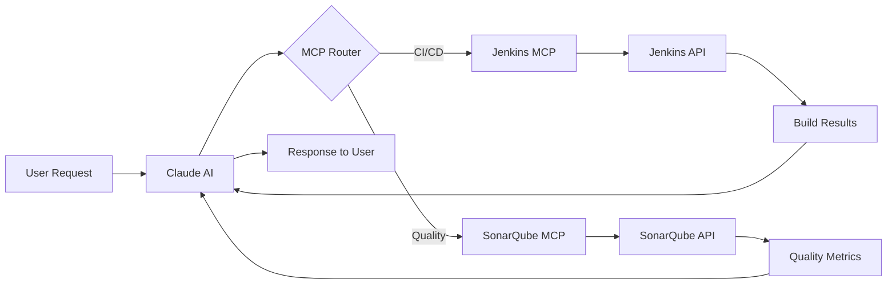

### Getting Started

1. **Install MCP SDK**
   ```bash
   npm install @modelcontextprotocol/sdk
   ```

2. **Create Jenkins MCP Server**
   ```typescript
   import { Server } from "@modelcontextprotocol/sdk/server/index.js";
   import { StdioServerTransport } from "@modelcontextprotocol/sdk/server/stdio.js";

   const server = new Server({
     name: "jenkins-mcp-server",
     version: "1.0.0"
   }, {
     capabilities: { tools: {} }
   });

   // Register tools...
   ```

3. **Configure Claude Desktop**
   ```json
   {
     "mcpServers": {
       "jenkins": {
         "command": "node",
         "args": ["path/to/jenkins-mcp-server/dist/index.js"],
         "env": {
           "JENKINS_URL": "http://localhost:9001",
           "JENKINS_USER": "admin",
           "JENKINS_TOKEN": "your-api-token"
         }
       },
       "sonarqube": {
         "command": "node",
         "args": ["path/to/sonar-mcp-server/dist/index.js"],
         "env": {
           "SONAR_URL": "http://localhost:9000",
           "SONAR_TOKEN": "your-sonar-token"
         }
       }
     }
   }
   ```

4. **Restart Claude Desktop** to load the MCP servers

---

## Testing MCP Servers with Simulator

Since the MCP Client is embedded in Claude Desktop, you need a simulator to test your MCP servers during development.

### Simulator Architecture

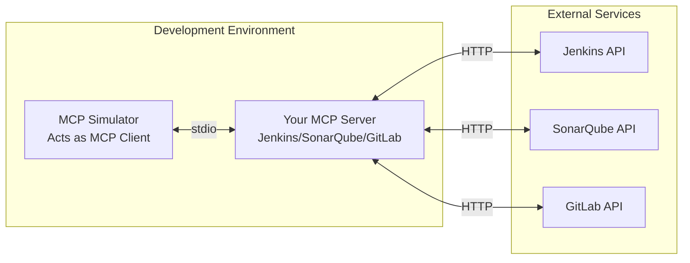

### Prerequisites

1. **Build the MCP servers first** (see [Building MCP Servers](#building-mcp-servers))
2. **Configure credentials** in `mcp-servers/config.json`
3. **Ensure services are running** (GitLab, Jenkins, SonarQube)

### Quick Start with Simulator

```bash
# 1. Navigate to simulator directory
cd mcp-simulator

# 2. Install dependencies
npm install

# 3. Start the interactive simulator
npm start
```

### Interactive Simulator Commands

When the simulator starts, you'll see a menu to select which MCP server to test:

```text
╔═══════════════════════════════════════════════════════════╗
║              MCP Server Simulator                         ║
╠═══════════════════════════════════════════════════════════╣
║  Select an MCP server to connect to:                      ║
║                                                           ║
║  1. Jenkins MCP Server                                    ║
║  2. SonarQube MCP Server                                  ║
║  3. GitLab MCP Server                                     ║
║  4. Exit                                                  ║
╚═══════════════════════════════════════════════════════════╝
```

Once connected, use these commands:

| Command | Description | Example |
|---------|-------------|---------|
| `tools` | List all available tools | `tools` |
| `resources` | List available resources | `resources` |
| `call <tool> <json>` | Call a tool with arguments | `call sonar_health_check {}` |
| `help` | Show help | `help` |
| `disconnect` | Disconnect from server | `disconnect` |
| `exit` | Exit simulator | `exit` |

### Testing Each MCP Server

#### Test SonarQube MCP Server

```bash
cd mcp-simulator
npm start

# Select option 2 (SonarQube)
# Then try these commands:

mcp> tools
# Lists all 13 SonarQube tools

mcp> call sonar_health_check {}
# Should return: { "status": "UP", ... }

mcp> call sonar_list_projects {}
# Lists all SonarQube projects

mcp> call sonar_get_metrics {"project_key": "my-project"}
# Get quality metrics for a project
```

#### Test Jenkins MCP Server

```bash
cd mcp-simulator
npm start

# Select option 1 (Jenkins)
# Then try these commands:

mcp> tools
# Lists all 10 Jenkins tools

mcp> call jenkins_health_check {}
# Should return Jenkins server info

mcp> call jenkins_list_jobs {}
# Lists all Jenkins jobs

mcp> call jenkins_trigger_build {"job_name": "my-job"}
# Triggers a build
```

#### Test GitLab MCP Server

```bash
cd mcp-simulator
npm start

# Select option 3 (GitLab)
# Then try these commands:

mcp> tools
# Lists all 20 GitLab tools

mcp> call gitlab_health_check {}
# Should return current user info

mcp> call gitlab_list_projects {"owned": true}
# Lists your GitLab projects

mcp> call gitlab_list_pipelines {"project_id": "1"}
# Lists pipelines for a project
```

### Option 2: MCP Inspector (Official Tool)

Use the official MCP Inspector for visual testing:

```bash
# Test Jenkins MCP Server
npx @modelcontextprotocol/inspector node mcp-servers/jenkins-mcp-server/dist/index.js

# Test SonarQube MCP Server
npx @modelcontextprotocol/inspector node mcp-servers/sonarqube-mcp-server/dist/index.js

# Test GitLab MCP Server
npx @modelcontextprotocol/inspector node mcp-servers/gitlab-mcp-server/dist/index.js
```

### Option 3: Direct Execution (Quick Verification)

To quickly verify a server starts correctly:

```bash
# From mcp-servers directory (so config.json is found)
cd mcp-servers

# Test SonarQube server starts
node sonarqube-mcp-server/dist/index.js
# Should show: "Loaded config from: .../config.json"
# Should show: "SonarQube MCP Server started"
# Press Ctrl+C to exit

# Test Jenkins server starts
node jenkins-mcp-server/dist/index.js

# Test GitLab server starts
node gitlab-mcp-server/dist/index.js
```

### Troubleshooting

**"Missing required configuration" error:**
```bash
# Ensure you're running from mcp-servers directory
cd mcp-servers
node sonarqube-mcp-server/dist/index.js

# Or set environment variables
SONAR_URL=http://localhost:9000 SONAR_TOKEN=your-token node sonarqube-mcp-server/dist/index.js
```

**"Cannot find module" error:**
```bash
# Rebuild the server
cd mcp-servers/sonarqube-mcp-server
npm run build
```

**Connection refused errors:**
```bash
# Ensure the service is running
docker-compose ps

# Check service is accessible
curl http://localhost:9000/api/system/status  # SonarQube
curl http://localhost:9001/api/json           # Jenkins
curl http://localhost:9003/api/v4/user        # GitLab (needs token)
```

### Testing Flow Diagram

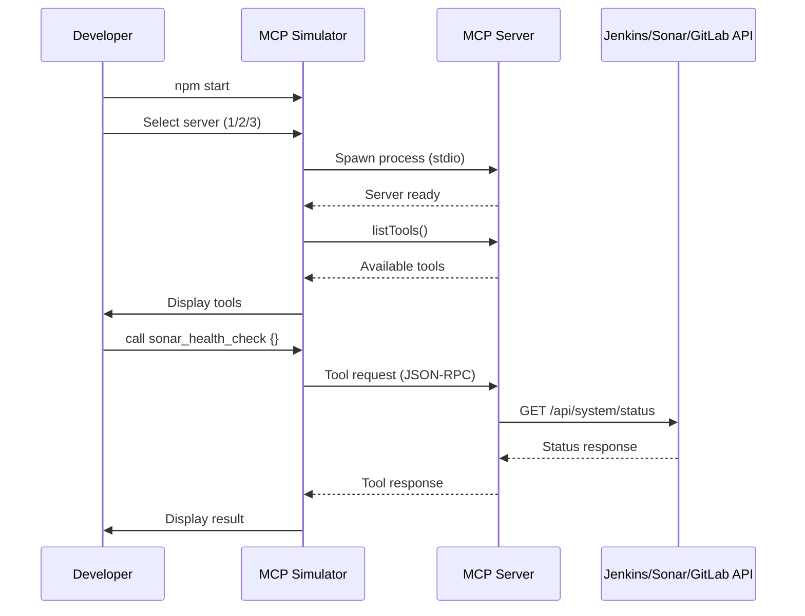

### Project Structure

```text
project-root/
├── mcp-servers/
│   ├── config.json              # Your credentials (gitignored)
│   ├── config.example.json      # Template
│   ├── jenkins-mcp-server/      # Jenkins MCP server
│   ├── sonarqube-mcp-server/    # SonarQube MCP server
│   ├── gitlab-mcp-server/       # GitLab MCP server
│   └── shared/                  # Shared utilities
│
├── mcp-simulator/               # Simulator for testing
│   ├── package.json
│   └── src/
│       └── simulator.js         # Main simulator code
│
└── README.md
```

---

## Jenkins MCP Server (Implemented)

The Jenkins MCP server is fully implemented and ready to use.

### Quick Start

```bash
# Build the server
cd mcp-servers/jenkins-mcp-server
npm install
npm run build

# Run with environment variables
JENKINS_URL=http://localhost:9001 \
JENKINS_USER=admin \
JENKINS_TOKEN=your-api-token \
npm start
```

### Available Tools

| Tool | Description |
| ---- | ----------- |
| `jenkins_health_check` | Check if Jenkins is accessible |
| `jenkins_list_jobs` | List all jobs (optionally by folder) |
| `jenkins_get_job` | Get job details and build history |
| `jenkins_trigger_build` | Trigger a build with optional parameters |
| `jenkins_get_build` | Get build status and details |
| `jenkins_get_build_log` | Get console output |
| `jenkins_abort_build` | Stop a running build |
| `jenkins_get_job_config` | Get job XML configuration |
| `jenkins_get_test_results` | Get test results |
| `jenkins_get_queue` | Check queued build status |

### Claude Desktop Configuration

```json
{
  "mcpServers": {
    "jenkins": {
      "command": "node",
      "args": ["/absolute/path/to/mcp-servers/jenkins-mcp-server/dist/index.js"],
      "env": {
        "JENKINS_URL": "http://localhost:9001",
        "JENKINS_USER": "admin",
        "JENKINS_TOKEN": "your-api-token"
      }
    }
  }
}
```

### Architecture

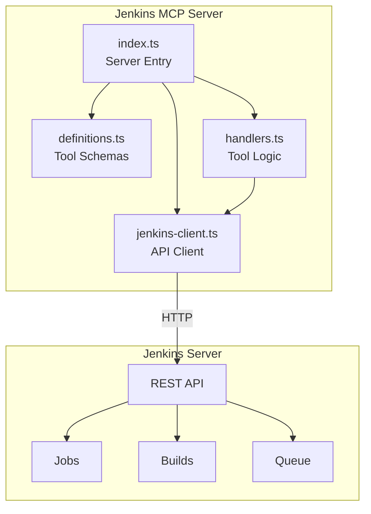

---

## SonarQube MCP Server (Implemented)

The SonarQube MCP server is fully implemented and ready to use.

### Quick Start

```bash
# Build the server
cd mcp-servers/sonarqube-mcp-server
npm install
npm run build

# Run with environment variables
SONAR_URL=http://localhost:9000 \
SONAR_TOKEN=sqa_your_token \
npm start
```

### Available Tools

| Tool | Description |
| ---- | ----------- |
| `sonar_health_check` | Check if SonarQube is accessible |
| `sonar_list_projects` | List all projects |
| `sonar_get_quality_gate` | Get quality gate status |
| `sonar_get_metrics` | Get code quality metrics |
| `sonar_get_issues` | Get bugs, vulnerabilities, code smells |
| `sonar_get_hotspots` | Get security hotspots |
| `sonar_get_coverage` | Get code coverage details |
| `sonar_get_duplications` | Get code duplication info |
| `sonar_get_source` | View source code |
| `sonar_get_analysis_history` | Get analysis history |
| `sonar_get_tasks` | Get background analysis tasks |
| `sonar_get_quality_gates` | List all quality gates |
| `sonar_get_rules` | Search analysis rules |

### Claude Desktop Configuration

```json
{
  "mcpServers": {
    "sonarqube": {
      "command": "node",
      "args": ["/absolute/path/to/mcp-servers/sonarqube-mcp-server/dist/index.js"],
      "env": {
        "SONAR_URL": "http://localhost:9000",
        "SONAR_TOKEN": "sqa_your_token_here"
      }
    }
  }
}
```

### Architecture

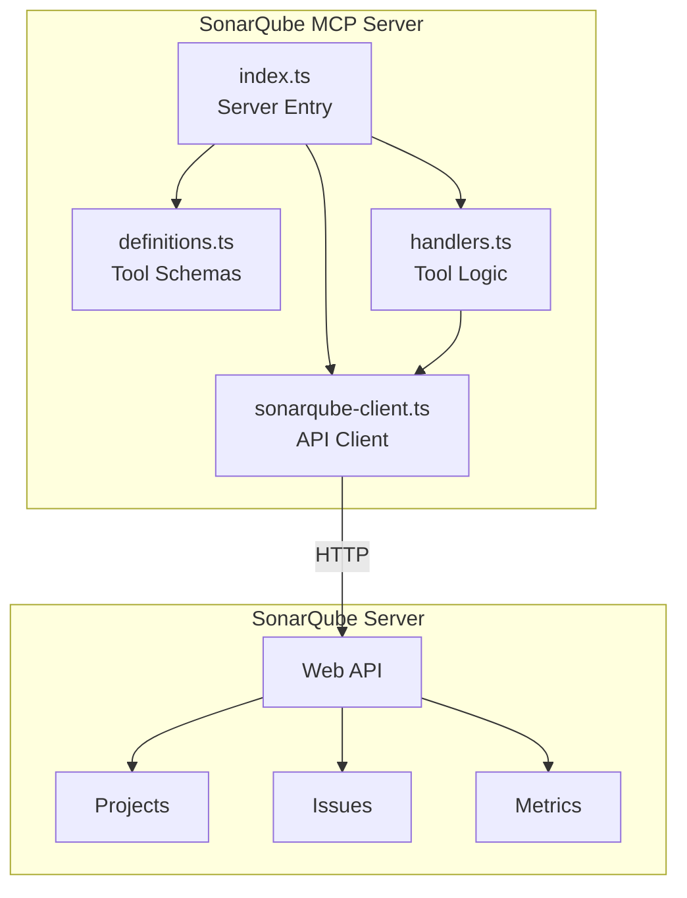

---

## GitLab MCP Server (Implemented)

The GitLab MCP server is fully implemented and ready to use.

### Quick Start

```bash
# Build the server
cd mcp-servers/gitlab-mcp-server
npm install
npm run build

# Run (uses config.json or environment variables)
npm start
```

### Available Tools (20 total)

| Tool | Description |
| ---- | ----------- |
| `gitlab_health_check` | Check connectivity and get current user info |
| `gitlab_list_projects` | List projects with filtering options |
| `gitlab_get_project` | Get detailed project information |
| `gitlab_list_branches` | List branches in a project |
| `gitlab_create_branch` | Create a new branch |
| `gitlab_list_merge_requests` | List merge requests with state filtering |
| `gitlab_get_merge_request` | Get detailed MR information |
| `gitlab_create_merge_request` | Create a new merge request |
| `gitlab_list_issues` | List issues with state/label filtering |
| `gitlab_create_issue` | Create a new issue |
| `gitlab_list_pipelines` | List CI/CD pipelines |
| `gitlab_get_pipeline` | Get pipeline details with jobs |
| `gitlab_trigger_pipeline` | Trigger a new pipeline |
| `gitlab_cancel_pipeline` | Cancel a running pipeline |
| `gitlab_retry_pipeline` | Retry a failed pipeline |
| `gitlab_get_job_log` | Get job console output |
| `gitlab_list_commits` | List commits in repository |
| `gitlab_get_file` | Get file content from repository |
| `gitlab_list_tree` | List files and directories |
| `gitlab_compare` | Compare branches/tags/commits |

### Claude Desktop Configuration

```json
{
  "mcpServers": {
    "gitlab": {
      "command": "node",
      "args": ["/absolute/path/to/mcp-servers/gitlab-mcp-server/dist/index.js"],
      "env": {
        "GITLAB_URL": "http://localhost:9003",
        "GITLAB_TOKEN": "glpat-your-token-here"
      }
    }
  }
}
```

### Generating GitLab Access Token

1. Log into GitLab at http://localhost:9003
2. Go to **User Settings** → **Access Tokens**
3. Create a token with these scopes:
   - `api` - Full API access
   - `read_repository` - Read repository
   - `write_repository` - Write repository
4. Copy and save the token

### Architecture

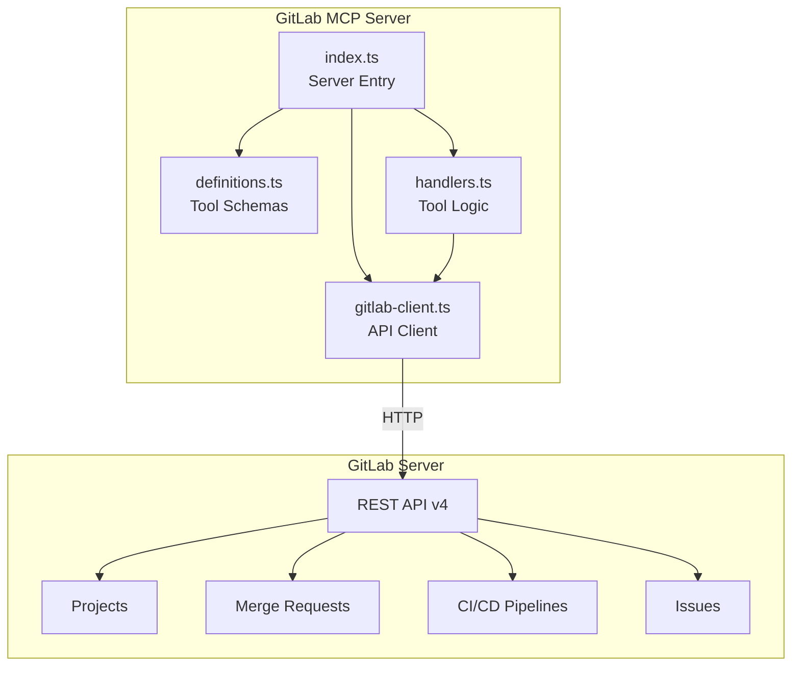

---

## CI/CD Infrastructure Setup

### Services Overview

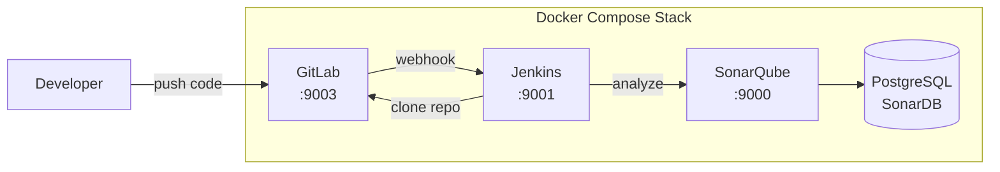

### Port Mapping

| Service | Port | URL |
| ------- | ---- | --- |
| GitLab (HTTP) | 9003 | http://localhost:9003 |
| GitLab (HTTPS) | 9443 | https://localhost:8443 |
| GitLab (SSH) | 2222 | ssh://git@localhost:2222 |
| Jenkins | 9001 | http://localhost:9001 |
| SonarQube | 9000 | http://localhost:9000 |

### Starting the Infrastructure

```bash
# Start all services
docker-compose up -d

# Check status
docker-compose ps

# View logs
docker-compose logs -f gitlab
docker-compose logs -f jenkins
```

### GitLab Initial Setup

1. **Wait for GitLab to start** (can take 3-5 minutes on first run):
   ```bash
   docker-compose logs -f gitlab | grep -i "ready"
   ```

2. **Get the initial root password**:
   ```bash
   docker exec gitlab cat /etc/gitlab/initial_root_password
   ```

3. **Access GitLab**: http://localhost:9003
   - Username: `root`
   - Password: (from step 2)

4. **Change the root password** (recommended)

### GitLab-Jenkins Integration

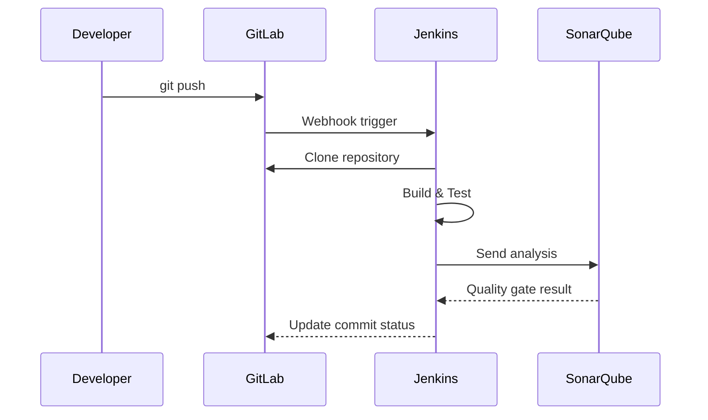

#### Step 1: Create GitLab Access Token

1. In GitLab, go to **User Settings** → **Access Tokens**
2. Create a token with scopes:
   - `api`
   - `read_repository`
   - `write_repository`
3. Save the token

#### Step 2: Install Jenkins Plugins

Install these plugins in Jenkins (**Manage Jenkins** → **Plugins**):
- GitLab Plugin
- Git Plugin
- Credentials Plugin

#### Step 3: Configure Jenkins Credentials

1. Go to **Manage Jenkins** → **Credentials**
2. Add credentials:
   - **Kind**: GitLab API token
   - **API Token**: (paste your GitLab token)
   - **ID**: `gitlab-token`

3. Add another credential:
   - **Kind**: Username with password
   - **Username**: `root` (or your GitLab user)
   - **Password**: (your GitLab password or token)
   - **ID**: `gitlab-credentials`

#### Step 4: Configure GitLab Connection in Jenkins

1. Go to **Manage Jenkins** → **System**
2. Find **GitLab** section
3. Configure:
   - **Connection name**: `gitlab`
   - **GitLab host URL**: `http://gitlab:80` (internal Docker network)
   - **Credentials**: Select `gitlab-token`
4. Click **Test Connection**

#### Step 5: Create Jenkins Pipeline

Example `Jenkinsfile` for a GitLab project:

```groovy
pipeline {
    agent any

    environment {
        SONAR_TOKEN = credentials('sonar-token')
    }

    stages {
        stage('Checkout') {
            steps {
                git branch: 'main',
                    credentialsId: 'gitlab-credentials',
                    url: 'http://gitlab/root/my-project.git'
            }
        }

        stage('Build') {
            steps {
                sh 'echo "Building..."'
                // Add your build commands here
            }
        }

        stage('Test') {
            steps {
                sh 'echo "Running tests..."'
                // Add your test commands here
            }
        }

        stage('SonarQube Analysis') {
            steps {
                withSonarQubeEnv('sonarqube') {
                    sh '''
                        sonar-scanner \
                            -Dsonar.projectKey=my-project \
                            -Dsonar.sources=. \
                            -Dsonar.host.url=http://sonarqube:9000 \
                            -Dsonar.login=$SONAR_TOKEN
                    '''
                }
            }
        }
    }

    post {
        success {
            updateGitlabCommitStatus name: 'build', state: 'success'
        }
        failure {
            updateGitlabCommitStatus name: 'build', state: 'failed'
        }
    }
}
```

#### Step 6: Configure GitLab Webhook

1. In GitLab, go to your project → **Settings** → **Webhooks**
2. Add webhook:
   - **URL**: `http://jenkins:8080/project/your-job-name`
   - **Secret Token**: (optional, configure in Jenkins)
   - **Trigger**: Push events, Merge request events
3. Click **Add webhook**

### Network Connectivity

All services are on the `ci-network` Docker network, so they can communicate using container names:

| From | To | URL |
| ---- | -- | --- |
| Jenkins | GitLab | `http://gitlab:80` |
| Jenkins | SonarQube | `http://sonarqube:9000` |
| GitLab | Jenkins | `http://jenkins:8080` |

### Troubleshooting

**GitLab takes too long to start:**
```bash
# Check GitLab logs
docker-compose logs gitlab

# GitLab needs at least 4GB RAM
# Reduce memory usage by disabling features in docker-compose.yml
```

**Jenkins can't connect to GitLab:**
```bash
# Test network connectivity
docker exec jenkins curl -I http://gitlab:80

# Check if GitLab is ready
docker exec gitlab gitlab-ctl status
```

**Webhook not triggering:**
```bash
# Check webhook delivery in GitLab
# Project → Settings → Webhooks → Edit → Recent Deliveries

# Ensure Jenkins is accessible from GitLab
docker exec gitlab curl -I http://jenkins:8080
```
